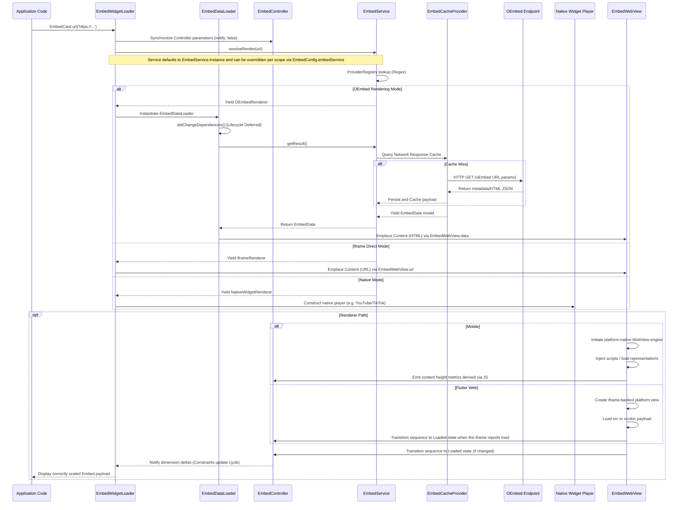
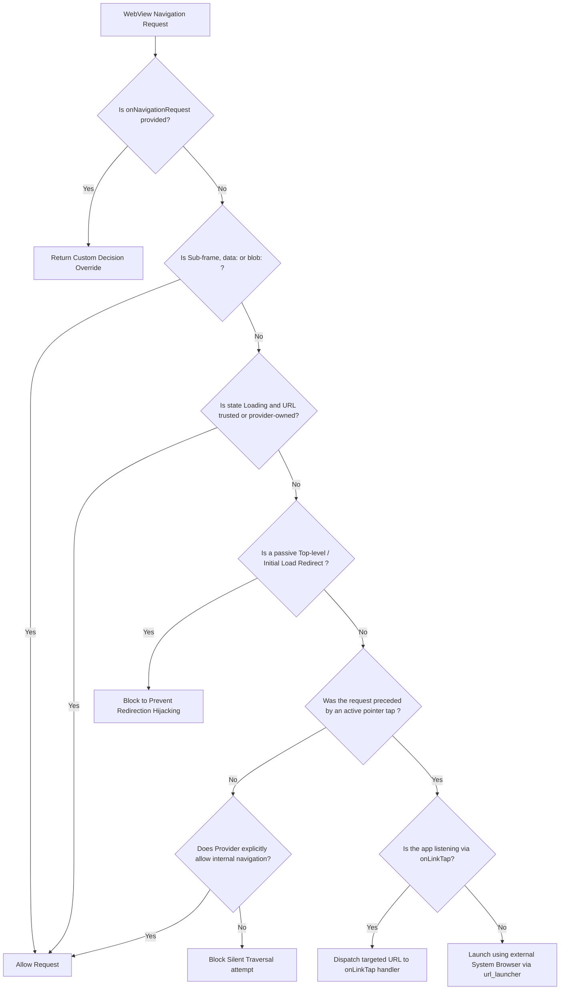

# `flutter_oembed` System Design & Flow

## Architectural Overview

`flutter_oembed` is a Flutter package that enables rendering rich social media and media content using oEmbed APIs. On Android and iOS it renders through a platform WebView; on Flutter Web it renders through an iframe-backed platform view. The architecture is designed to handle fetching data from various oEmbed providers, caching API responses, managing dynamic layout configurations, and coordinating interactions with the active platform renderer.

### Core Components

1. **Presentation Layer (Widgets)**
   - **`EmbedCard`**: The primary user-facing widget used to embed content. It accepts the target content URL and merges its local configurations with the global configuration.
   - **`EmbedWidgetLoader`**: An internal orchestrator that connects global states with the widgets. Depending on the resolution strategy, it hands off rendering to a native widget player (e.g., `YoutubeEmbedPlayer`, `TiktokEmbedPlayer`), a direct Iframe renderer, or the standard `EmbedDataLoader` that fetches layout representations from the provider API.
   - **`EmbedScope`**: An `InheritedWidget` that supplies sweeping, global configurations across the app (like `EmbedConfig`, global caching strategies, navigation overrides, lazy-load settings, and visual themes).

2. **Control & Coordination Layer**
   - **`EmbedController`**: Serves as the mutable state object over the lifecycle of an embed. It observes network loading states, records internal errors, manages embed dimension parameters resulting from UI mutations, and exposes high-level, best-effort commands to control media instances (e.g., playing, pausing, muting).
   - **`EmbedWebView`**: The shared render surface used by the standard pipeline. It selects a platform-native WebView path on mobile and an iframe-backed `HtmlElementView` path on Flutter Web.
   - **`EmbedWebViewControls`**: Mobile-only controls exposed to `webViewBuilder`. These remain backed by `webview_flutter` and are not currently surfaced on Flutter Web.
   - **`EmbedWebViewDriver`**: Mobile-only driver that bridges `webview_flutter` with Flutter lifecycle events such as route-cover pausing, JavaScript channel events, and focus polling strategies.

3. **Service / Network / Routing Layer**
   - **`EmbedService`**: The core data dispatcher deciding how a specific URL should be mapped and fetched algorithmically.
   - **`ProviderRegistry`**: Evaluates requested URLs against custom developer rules and hardcoded API definitions. Matches regular expressions and domain paths for canonical oEmbed providers.
   - **`EmbedCacheProvider`**: Handles persistent network response caching logic. It supports customizable backend engines (`flutter_cache_manager` by default) to dramatically reduce latency and repetitive layout jittering constraints by serving localized HTML representations instantly.

---

## Data Flow & Lifecycle Initialization

The following sequence details how an embed is initialized, resolved, requested, and rendered back on screen.

## Platform Notes

- **Mobile**: The driver-backed WebView path is still the reference implementation. It owns JavaScript channels, navigation interception, media control, and post-load height measurement.
- **Flutter Web**: The iframe-backed path is intentionally lighter. It can render direct iframe URLs and provider HTML through `srcdoc`, but it does not currently expose `EmbedWebViewControls`, full navigation interception parity, or the same media-control guarantees as the mobile driver.
- **Flutter Web default render mode**: Providers with stable direct iframe builders (`YouTube`, `Vimeo`, `Spotify`, and `TikTok`) now default to iframe mode on web so the pipeline can skip CORS-blocked oEmbed fetches unless the app explicitly overrides that provider back to `oembed`.

---

## WebView Navigation Handling Policy

Security is strongly mandated when executing untrusted scripts provided by general-purpose external media sources. Built-in logic isolates the host application against URL hijack vulnerabilities or unauthorized redirect attempts natively.

## Styling and Scale Pipeline

1. **Initial Protocol Handling**: An embed is rendered using a default height or static definitions based on constraints. When an embed completes initial rendering passes, the library intercepts dimensions and parses provider sizing structures encoded inside JSON parameters (`width`/`height` attributes against aspect ratios).
2. **Dynamic DOM Adjustments**: `EmbedWebViewDriver` attaches JavaScript observers to watch changes in `document.body.scrollHeight`. These scripts signal discrete callbacks across webview channel interconnects.
3. **Adjustment Debouncing Cycles**: `EmbedController` consumes height variations. To avoid jank looping architectures caused by small sub-pixel rounding mismatches by mobile GPU compositors, values under the configurable `heightUpdateDeltaThreshold` constant are systematically ignored.
4. **Relayout Commitment**: Valid dimension mutations trigger state reconstruction updates via `AnimatedBuilder`, accurately scaling bounding boxes and snapping seamlessly on top of dynamically morphing web content layouts.
